# acdev — cd into a project, land in an Apple Container

`cd` into a directory that has an `.applecontainer.toml` and you land in a
Flox-activated shell inside a hardware-isolated Linux microVM, using Apple's
native [`container`](https://github.com/apple/container) CLI. No Docker, no Dev
Containers extension.

`acdev` is published on FloxHub as `jbayer/acdev` (the CLI plus bash/zsh/fish
hooks). The `acdev-demo/` environment shows the whole flow.



## Requirements

- Apple silicon Mac on macOS 26 (Tahoe)
- Apple `container` 1.5.0 (the version acdev is tested with), installed and
  running (`container system start`)
- [Flox](https://flox.dev) on the host

## Quick start

```bash
flox activate -d acdev-demo     # installs jbayer/acdev, loads the hooks, starts the Nix cache
cd acdev-demo/demo-project      # → acdev up && acdev shell, you're in the container
```

Exiting the shell leaves the container running, so the next `cd` back in is
instant. [acdev-demo/TRY-IT.md](acdev-demo/TRY-IT.md) is a longer walkthrough.

## Use it in your own environment

Install the package and source the hook for your shell from `[profile]`:

```toml
[install]
acdev.pkg-path = "jbayer/acdev"

[profile]
bash = '''
  [ -r "$FLOX_ENV/share/acdev/hooks/acdev.bash" ] && . "$FLOX_ENV/share/acdev/hooks/acdev.bash"
'''
zsh = '''
  [ -r "$FLOX_ENV/share/acdev/hooks/acdev.zsh" ] && . "$FLOX_ENV/share/acdev/hooks/acdev.zsh"
'''
fish = '''
  test -r "$FLOX_ENV/share/acdev/hooks/acdev.fish"; and source "$FLOX_ENV/share/acdev/hooks/acdev.fish"
'''
```

Then run `acdev init` in any project to make it acdev-managed.

## Commands

```bash
acdev init           # write a starter .applecontainer.toml (no-op if one exists)
acdev up             # create, restart, or reuse the project container
acdev shell          # enter it
acdev status         # name / state / image and running digest / mount / IP
acdev down [--rm]    # stop it (--rm also removes it)
acdev up --dry-run   # print the container commands without running them
```

## Configuration

Every key in `.applecontainer.toml` is optional; an empty file works.

| Key | Default | Meaning |
|---|---|---|
| `image` | see below | Container image |
| `user` | image default | User to run and exec as |
| `workspace` | `/workspaces/<dir name>` | Where the project is mounted |
| `shell` | `bash` | Shell `acdev shell` starts |
| `flox` | `auto` | `auto` activates Flox if the project has `.flox/`; `true`/`false` force it |
| `nix_cache` | unset | Host Nix cache URL (see [below](#shared-nix-cache)) |
| `[env]` | none | `KEY = "value"` pairs passed into the container |

**Image resolution:** the project's `image`, else `$ACDEV_DEFAULT_IMAGE`, else
`jbayer/devcontainer-flox:latest`. `acdev init` leaves `image` commented out,
so new projects follow the default. To pin every project under an environment
(for example to a digest), set it in that environment's `[vars]`:

```toml
[vars]
ACDEV_DEFAULT_IMAGE = "jbayer/devcontainer-flox:latest@sha256:..."
```

> **Settings apply when the container is created.** `acdev up` reuses an
> existing container, so after changing `image`, `user`, `workspace`, `[env]`,
> or `nix_cache`, or to pick up a newer `:latest`, recreate it:
> `acdev down --rm && container image pull <image> && acdev up`.
> When the image is what changed, `acdev up` warns that the container is
> stale. It compares against images already on your Mac, so it won't notice a
> newer `:latest` you haven't pulled.

## How it works

- Each project gets one long-lived container, kept alive by `sleep infinity`.
  Your shell is a separate `container exec` session.
- The container name comes from the project's absolute path
  (`acdev-<dir>-<hash>`), so it's stable and reused.
- Reach services in the container by its IP (`acdev status`); that's more
  reliable on Apple Container than published ports.

## Shared Nix cache

An optional host-side nginx proxy caches `cache.flox.dev` and `cache.nixos.org`
so project containers don't re-download the same packages. Signatures pass
through unchanged.

- **Start it:** `acdev-demo` runs it as an auto-started service on port 8126.
  Elsewhere, run `acdev-nix-cache`.
- **Use it:** set `nix_cache = "http://192.168.64.1:8126"`. `acdev init` writes
  this line automatically when the proxy is running. acdev passes it to the
  container as an extra Nix substituter.
- **Tuning:** `ACDEV_NIX_CACHE_PORT` (default 8126), `ACDEV_NIX_CACHE_DIR`
  (cache location), and `ACDEV_NIX_CACHE_LISTEN` (default `0.0.0.0`; set it to
  `192.168.64.1` to listen only on the container network, which exists only
  while a container is running).
- **Limitation:** packages from `flox publish` aren't cached. Flox fetches them
  from S3, bypassing Nix substituters, so they re-download in each new
  container. Reusing a container instead of `--rm` avoids that. See
  [docs/nix-cache-published-packages-findings.md](docs/nix-cache-published-packages-findings.md).

## Troubleshooting

- **`the 'container' CLI was not found`** or **`cannot reach the container
  service`**: install Apple `container`, or run `container system start`.
  `up`, `status`, and `down` check this first; `init` and `--dry-run` don't
  need the daemon.
- **Wrong image or Flox version in the container:** `acdev up` warns when the
  container's image doesn't match the config, and `acdev status` shows both
  the configured `image` and the `digest` the container was created from. Check
  for an `image` line in `.applecontainer.toml`, then recreate the container
  (see the note under [Configuration](#configuration)).
- **`internalError: "createProcess"` on start:** `user` names a user that
  doesn't exist in the image. The default image has `flox`; stock `ubuntu` has
  only `root` and `ubuntu`. Check with `container run --rm <image> id <user>`.

## Without Flox

```bash
ln -s "$PWD/bin/acdev" /usr/local/bin/acdev
echo "source $PWD/hooks/acdev.zsh" >> ~/.zshrc   # or acdev.bash / acdev.fish
```

## Development

```bash
flox activate -- bats tests/                            # test suite
flox activate -- shellcheck bin/acdev bin/acdev-nix-cache
flox build acdev                                        # build the package
```

The version lives in `ACDEV_VERSION` in `bin/acdev`, and the Flox build reads it
from there.

Background notes are in `docs/`:
[Apple Container reference](docs/apple-container-reference.md),
[storage and networking findings](docs/apple-container-storage-networking-findings.md),
and [Nix cache vs. published packages](docs/nix-cache-published-packages-findings.md).

## Related: `container machine`

[machine/](machine/README.md) has a systemd Ubuntu 24.04 image for Apple
`container machine`, a long-lived VM with your macOS user and home directory.
It's separate from acdev.
